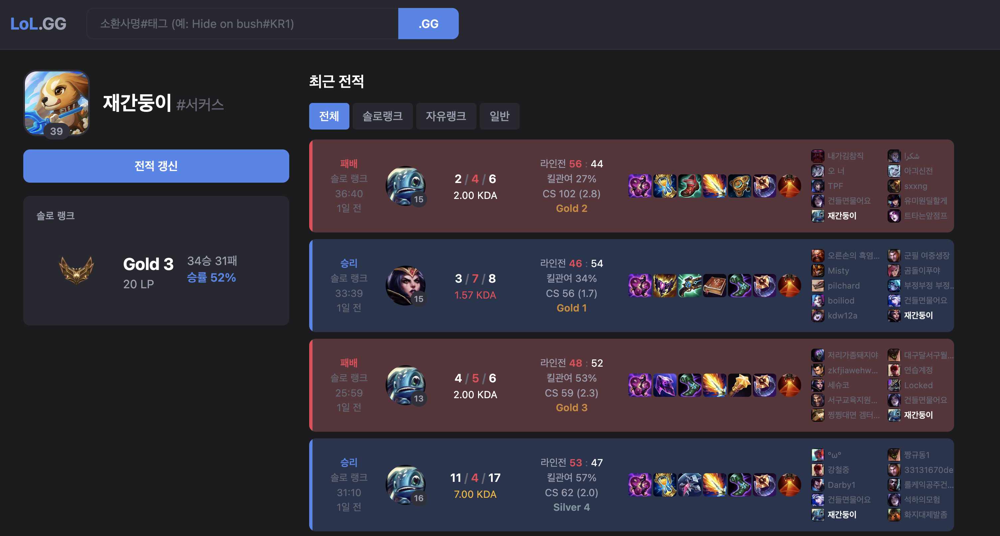

# LoL.GG

리그오브레전드 전적 검색 서비스

## Preview



## Tech Stack

- **Backend**: Spring Boot 3 / Java 21
- **Frontend**: Vue 3 / Vite / Tailwind CSS v4
- **Data**: Riot Games API (Account-V1, Summoner-V4, League-V4, Match-V5)

## Features

- 소환사명#태그로 전적 검색
- 솔로랭크 / 자유랭크 정보 표시
- 게임 모드별 탭 필터링 (전체, 솔로랭크, 자유랭크, 일반)
- 매치 상세 정보 (KDA, CS, 피해량, 아이템, 라인전 스코어)
- 참가자 티어 및 평균 티어 표시

## Getting Started

### 사전 준비

- Java 21
- Node.js 18+
- [Riot API Key](https://developer.riotgames.com/)

### Backend

```bash
cd backend
echo "RIOT_API_KEY=your-api-key" > .env
./gradlew bootRun        # http://localhost:8080
```

### Frontend

```bash
cd frontend
npm install
npm run dev              # http://localhost:5173
```

두 서버를 동시에 실행해야 합니다. 프론트엔드가 `/api/*` 요청을 백엔드로 프록시합니다.
